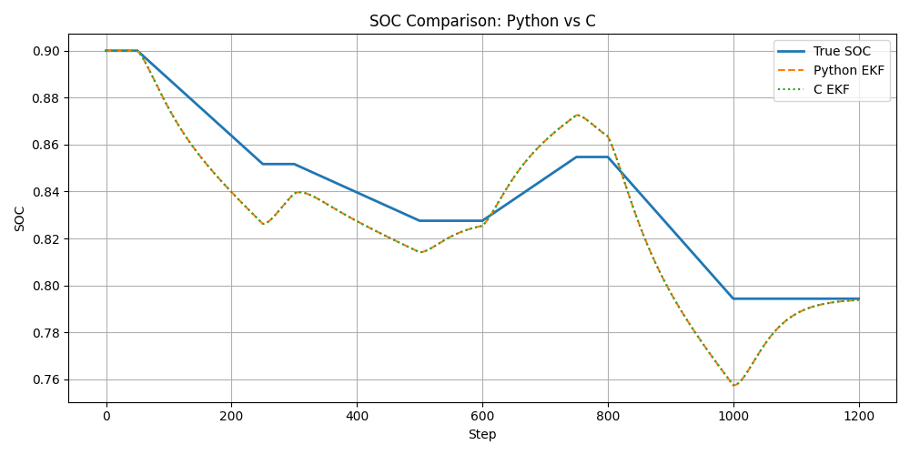
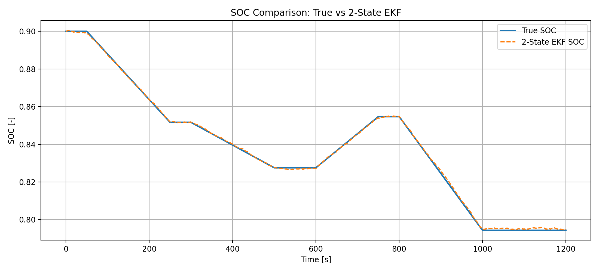
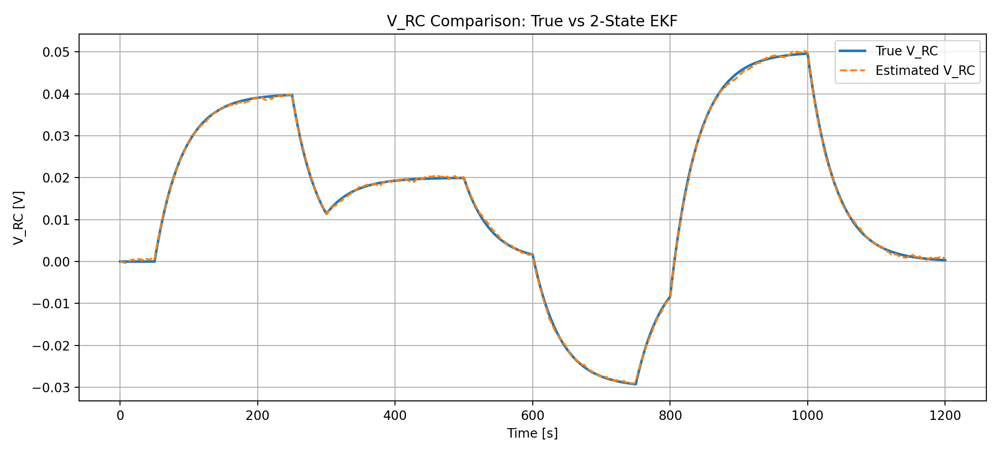
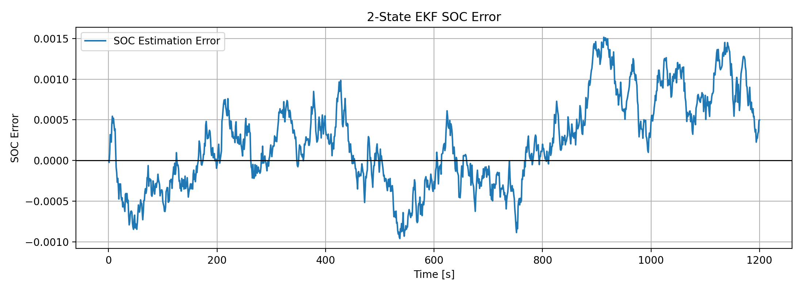

# 🔋 Battery SOC Estimation using Equivalent Circuit Models, EKF, and Embedded Implementation

## 📌 Overview

This project presents a model-based approach for estimating the **State of Charge (SOC)** of a lithium-ion battery using:

* A **first-order equivalent circuit model (1RC)**
* A **1-state Extended Kalman Filter (EKF)** for baseline SOC estimation
* A **2-state EKF** with states:

  * `SOC`
  * `V_RC`
* A lightweight **embedded-oriented implementation**
* A **C-based firmware-style implementation**
* **Python vs C validation** of the estimator

The project demonstrates a complete workflow from battery simulation to embedded-friendly implementation and estimator improvement.

---

## 🎯 Objective

* Simulate battery voltage and current behavior under dynamic load conditions
* Estimate SOC using model-based methods
* Compare **true SOC** and **estimated SOC**
* Improve estimation accuracy by extending the EKF state model
* Develop an embedded-oriented implementation
* Translate the estimator into C for firmware-oriented deployment
* Validate the C implementation against the Python reference

---

## ⚙️ Methodology

### 1. Battery Modeling

* First-order RC equivalent circuit model
* Nonlinear OCV-SOC relationship
* Terminal voltage model:

```text id="m4n7ah"
V_terminal = OCV(SOC) - I*R0 - V_RC
```

### 2. Python Simulation

* Time-domain current profile
* Terminal voltage response
* SOC propagation using current integration

### 3. 1-State EKF

The initial EKF formulation estimated only:

* `SOC`

This provided a baseline estimator and enabled:

* Q/R tuning
* sensitivity analysis
* embedded-oriented reformulation

### 4. 2-State EKF

The EKF was extended to estimate:

* `SOC`
* `V_RC`

This reduced the mismatch between the estimator and the battery simulation model and significantly improved estimation accuracy.

### 5. Embedded-Oriented Implementation

* Step-based estimator update
* Lightweight structure for real-time use
* Reduced computational complexity

### 6. C Firmware-Style Implementation

* Struct-based estimator state
* EKF logic implemented in C
* Test execution in a desktop compiler environment

### 7. Validation

* Python EKF output compared with C EKF output
* Matching results confirm correct translation of the estimator logic

---

## 📊 Example Results

### 🔹 Current Profile


### 🔹 Voltage Response


### 🔹 Python vs C Validation



### 🔹 2-State EKF SOC Comparison



### 🔹 2-State EKF V_RC Comparison



### 🔹 2-State EKF SOC Error



---

## ✅ 2-State EKF Improvement

To improve estimation accuracy, the EKF was extended from a 1-state formulation to a 2-state model:

* `SOC`
* `V_RC`

This improved consistency between the estimator and the battery simulation model.

### Performance

* **MAE:** 0.000477
* **RMSE:** 0.000597

This result shows a clear improvement over the simpler 1-state EKF approach.

---

## 📁 Project Structure

```text id="qtwud6"
battery-soc-estimation/
│
├── src/
│   ├── main.py
│   ├── ekf_soc.py
│   ├── embedded_soc_step.py
│   ├── test_embedded_soc.py
│   └── compare_results.py
│
├── c_version/
│   ├── ekf_soc.h
│   ├── ekf_soc.c
│   └── main.c
│
├── data/
├── results/
├── figures/
│
├── README.md
└── requirements.txt
```

---

## ▶️ How to Run

### Python Version

Install dependencies:

```bash id="q1mot1"
pip install numpy matplotlib pandas
```

Run the main simulation:

```bash id="imzm1s"
python src/main.py
```

Run embedded-oriented simulation:

```bash id="6616g4"
python src/test_embedded_soc.py
```

Run Python vs C comparison:

```bash id="ba2omj"
python src/compare_results.py
```

---

### C Version

Compile:

```bash id="v9k91y"
gcc main.c ekf_soc.c -o ekf_test -lm
```

Run:

```bash id="uusq63"
./ekf_test
```

---

## 📈 Output

The project generates:

* Current profile plot
* Voltage response plot
* Embedded-oriented SOC comparison
* Python vs C validation plot
* 2-state EKF SOC comparison
* 2-state EKF V_RC comparison
* 2-state EKF SOC error plot
* CSV output files for further analysis

---

## ✅ Validation Summary

The C implementation was validated against the Python reference implementation.

The final comparison showed that the **C implementation closely matches the Python EKF output**, confirming that the estimator logic was correctly translated into a firmware-style implementation.

---

## 🚀 Features

* Physics-based battery modeling
* 1-state EKF baseline estimator
* Q/R tuning workflow
* 2-state EKF with improved model fidelity
* Embedded-oriented algorithm design
* C firmware-style implementation
* Python vs C validation

---

## 🔧 Future Work

* Port the **2-state EKF** to the C implementation
* Include temperature effects
* Improve the battery model further (e.g. 2RC model)
* Validate with real battery datasets
* Deploy on STM32 / Arduino
* Explore fixed-point implementation for embedded targets

---

## 🧠 Key Takeaway

This project demonstrates how **model-based battery estimation** can be developed in Python, improved through EKF state augmentation, adapted for embedded-oriented execution, translated into C, and validated across implementations.

---

## 👤 Author

Hossein Electronics Engineer

