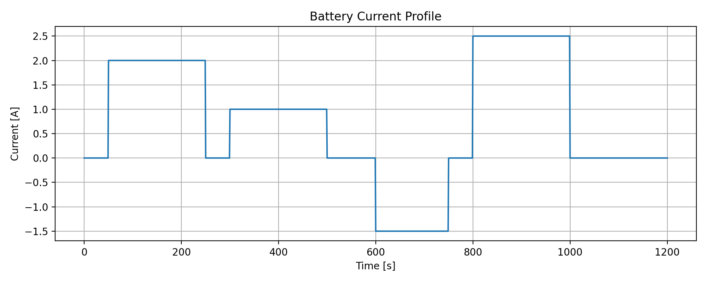
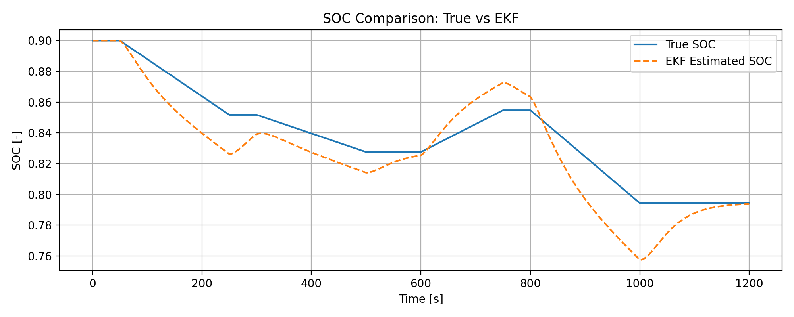
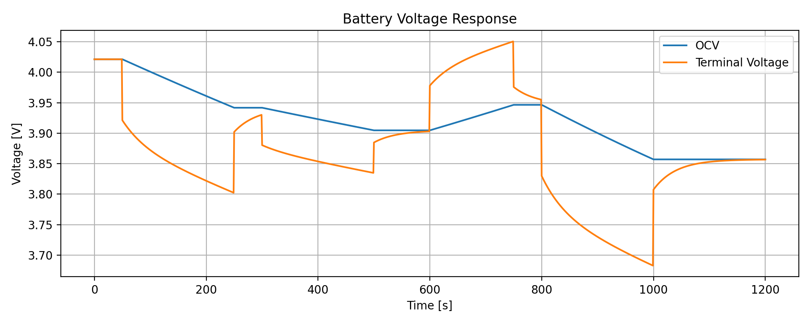
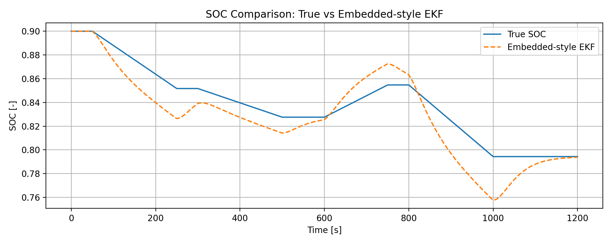

# 🔋 Battery SOC Estimation using Equivalent Circuit Models and EKF

## 📌 Overview

This project presents a model-based approach for estimating the **State of Charge (SOC)** of a lithium-ion battery using:

* A simple **Equivalent Circuit Model (RC model)**
* An **Extended Kalman Filter (EKF)** for state estimation
* A lightweight **embedded-oriented implementation** for real-time applications

The implementation demonstrates how battery behavior can be modeled and how SOC can be estimated using both simulation and embedded-style execution.

---

## 🎯 Objective

* Simulate battery voltage and current behavior
* Estimate SOC using a physics-based model
* Apply EKF for improved SOC estimation
* Develop an embedded-friendly version of the estimator
* Compare **true SOC vs estimated SOC**

---

## ⚙️ Methodology

### 1. Battery Modeling

* First-order RC equivalent circuit model
* Nonlinear OCV-SOC relationship

### 2. Simulation

* Time-based current profile (charge/discharge)
* Voltage response generation

### 3. State Estimation (EKF)

* Prediction step using system dynamics
* Update step using voltage measurement
* Nonlinear measurement handling

### 4. Embedded-Oriented Implementation

* Step-by-step SOC update (real-time style)
* Lightweight computation
* Suitable for microcontroller execution

---

## 📊 Example Results

### 🔹 Current Profile



### 🔹 SOC Comparison (True vs EKF)



### 🔹 Voltage Response



### 🔹 Embedded SOC Comparison



---

## 📁 Project Structure

```
battery-soc-estimation/
│
├── src/
│   ├── main.py
│   ├── ekf_soc.py
│   ├── embedded_soc_step.py
│   └── test_embedded_soc.py
│
├── data/
├── results/
├── figures/
│
├── README.md
└── requirements.txt
```

---

## ▶️ How to Run

### 1. Install dependencies

```
pip install numpy matplotlib
```

### 2. Run main simulation

```
python src/main.py
```

### 3. Run embedded-style simulation

```
python src/test_embedded_soc.py
```

---

## 📈 Output

The project generates:

* SOC profile (true vs EKF)
* Embedded-style SOC estimation
* Battery voltage response
* Current profile
* CSV file with simulation results

---

## 🚀 Features

* Physics-based battery modeling
* Nonlinear OCV-SOC relationship
* EKF-based SOC estimation
* Embedded-oriented implementation
* Visualization of estimation performance

---

## 🔧 Future Work

* Tune EKF parameters (Q, R)
* Include temperature effects
* Extend model to 2RC equivalent circuit
* Convert algorithm to C for embedded systems
* Deploy on microcontroller (STM32 / Arduino)

---

## 🧠 Key Takeaway

This project demonstrates how **model-based estimation combined with EKF** can be used to track battery SOC, and how the algorithm can be adapted for **embedded real-time applications**.

---

## 👤 Author

Hossein Electronics Engineer

