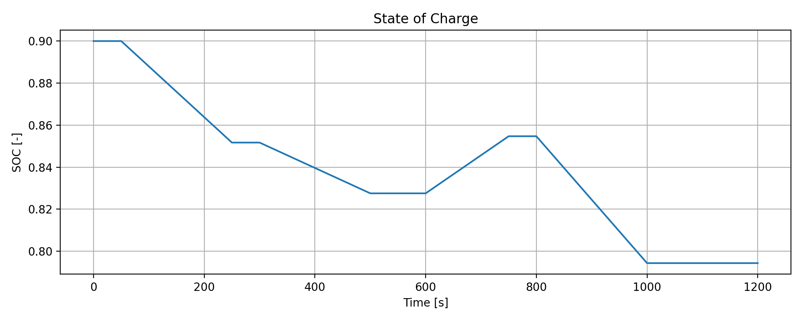

# Battery SOC Estimation using Equivalent Circuit Models

## Overview

This project presents a model-based approach for estimating the State of Charge (SOC) of a lithium-ion battery using a simple equivalent circuit model (1RC).

The implementation demonstrates how battery behavior can be approximated and analyzed using system modeling, simulation, and basic estimation techniques.

---

## Objective

* Simulate battery behavior under different load conditions
* Estimate SOC using Coulomb counting
* Analyze the relationship between OCV and terminal voltage
* Demonstrate the effect of internal resistance and dynamic response

---

## Methodology

### Battery Model

A first-order equivalent circuit model (1RC) is used:

* Ohmic resistance (R0)
* RC network (R1, C1) for dynamic behavior

### SOC Estimation

SOC is calculated using Coulomb counting:

SOC(t) = SOC(t-1) - (I * dt / Q)

### Voltage Model

Terminal voltage is computed as:

V_terminal = OCV(SOC) - I * R0 - V_RC

Where:

* OCV is approximated as a function of SOC
* V_RC models transient voltage behavior

---

## Features

* Time-domain battery simulation
* Custom current profile (charge/discharge)
* SOC tracking
* Voltage response analysis
* Data export (CSV)
* Automatic plot generation

---

## Project Structure

```
battery-soc-estimation/
│
├── src/
│   └── main.py               # Simulation code
│
├── data/                     # (reserved for future use)
│
├── results/
│   └── simulation_results.csv
│
├── figures/
│   ├── current_profile.png
│   ├── soc_profile.png
│   └── voltage_response.png
│
└── README.md
```

---

## Example Results

### Current Profile


### State of Charge



### Voltage Response


---

## How to Run

### Requirements

* Python 3.x
* numpy
* matplotlib

### Run

```bash
pip install numpy matplotlib
python src/main.py
```

---

## Key Insights

* SOC decreases during discharge and increases during charging
* Terminal voltage deviates from OCV due to internal resistance
* RC network captures transient dynamics of battery response
* Simple models can still provide meaningful engineering insight

---

## Limitations

* OCV-SOC relationship is simplified
* Temperature effects are not modeled
* No aging or degradation included
* Coulomb counting is sensitive to current measurement errors

---

## Future Work

* Implement Kalman Filter (EKF) for improved SOC estimation
* Add temperature dependency
* Use real battery datasets
* Extend to multi-cell battery systems
* Optimize for embedded implementation

---

## Author

Hossein (Electronics Engineer, PhD)

Interested in:

* Battery Management Systems (BMS)
* Control Systems
* Embedded Systems
* Energy Applications
